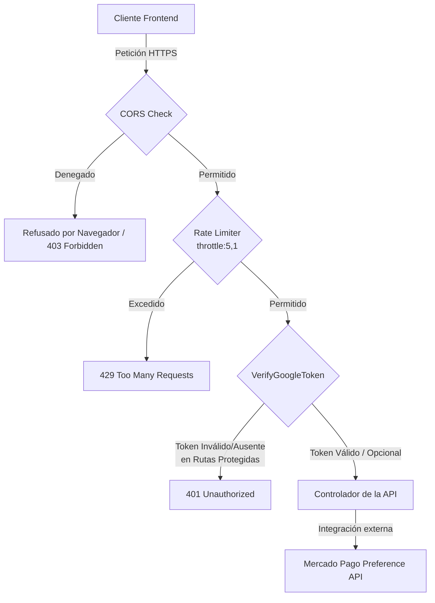

# Documentación Técnica de la API (Backend) - GambaStore

Esta documentación detalla la arquitectura, el diseño de seguridad, la especificación de endpoints y las prácticas de despliegue para la API de **GambaStore**, implementada con el framework **Laravel 11**.

---

## 1. Introducción

El backend de **GambaStore** está concebido bajo el paradigma de **API RESTful**, exponiendo una interfaz orientada a recursos a través del protocolo HTTPS. 

### Stack Tecnológico
*   **Framework Principal:** Laravel 11 (PHP 8.2+)
*   **Base de Datos / Persistencia:** Relacional (representada a través del mapeador objeto-relacional Eloquent)
*   **Integración de Pasarela:** SDK de Mercado Pago (para la generación dinámica de preferencias de pago)
*   **Proveedor de Identidad:** Google Identity Center / Firebase Authentication

El propósito fundamental de esta API es proveer un catálogo de productos estructurado, gestionar dinámicamente cupones y promociones, procesar compras bajo una lógica de negocio híbrida (usuarios registrados e invitados) y orquestar transacciones seguras derivando el flujo al checkout de Mercado Pago.

---

## 2. Seguridad (Capas de Protección)

La seguridad es el pilar central del backend de GambaStore. Se han diseñado e implementado múltiples capas de defensa para resguardar la integridad del sistema contra vectores de ataque comunes (OWASP Top 10) y prevenir el abuso de recursos.



### 2.1. CORS Estricto (Cross-Origin Resource Sharing)
Para mitigar ataques de tipo *Cross-Site Request Forgery (CSRF)* y restringir el consumo no autorizado de la API desde orígenes desconocidos, se implementa una política CORS restrictiva mediante el middleware nativo `HandleCors` (registrado globalmente en [bootstrap/app.php](file:///C:/Users/patri/Proyectos/Aplicaciones Web/GambaStore/bootstrap/app.php#L30-L32)).

La configuración explícita en [config/cors.php](file:///C:/Users/patri/Proyectos/Aplicaciones Web/GambaStore/config/cors.php) establece:
*   **Origen Autorizado:** Únicamente `https://gambastore-frontend.vercel.app` (el dominio oficial del frontend en producción). No se permiten comodines (`*`).
*   **Métodos Permitidos:** `POST`, `GET`, `OPTIONS`, `PATCH`, `DELETE`.
*   **Headers Permitidos:** `*` (cualquier header enviado por el cliente, permitiendo cabeceras personalizadas de autenticación).
*   **Soporte de Credenciales:** Habilitado (`supports_credentials => true`), facilitando la transmisión segura de tokens o cookies si fuera requerido en futuras extensiones.
*   **Cacheo de Preflight:** `max_age => 86400` (24 horas). Esto optimiza la latencia del cliente al evitar que el navegador envíe peticiones repetitivas de verificación `OPTIONS` en cada petición API subsecuente.

### 2.2. Rate Limiting (Protección DoS y Spamming)
El procesamiento de compras implica la invocación a la API externa de Mercado Pago y operaciones intensivas de base de datos. Para evitar la denegación de servicio (DoS) o el agotamiento del saldo de llamadas de la API de pago por ataques automatizados, se ha aplicado un limitador de tasa (*Rate Limiter*) estricto sobre el endpoint de creación de pedidos:

*   **Middleware:** `throttle:5,1` configurado en la ruta de creación de pedidos en [routes/api.php](file:///C:/Users/patri/Proyectos/Aplicaciones Web/GambaStore/routes/api.php#L17).
*   **Límite:** Máximo de **5 peticiones por minuto** por dirección IP.
*   **Comportamiento en Exceso:** Al exceder el límite, el servidor responde inmediatamente con un código de estado `429 Too Many Requests` acompañado de las cabeceras HTTP `Retry-After` para instruir al cliente cuándo puede reintentar la operación.

### 2.3. Autenticación y Autorización (Naturaleza Híbrida)
La API implementa un esquema de autenticación basado en **Bearer Tokens (Google ID Tokens)**. La lógica está descentralizada en el middleware personalizado [VerifyGoogleToken](file:///C:/Users/patri/Proyectos/Aplicaciones Web/GambaStore/app/Http/Middleware/VerifyGoogleToken.php) (`auth.google`), el cual realiza las siguientes acciones:

1.  **Extracción del Token:** Lee la cabecera HTTP `Authorization: Bearer <id_token>`.
2.  **Verificación Criptográfica:** Mediante el componente `Google\Auth\AccessToken`, valida la autenticidad de la firma frente a las llaves públicas de Google, el tiempo de expiración del token (`exp`) y que la audiencia (`aud`) coincida con el identificador del cliente configurado (`GOOGLE_CLIENT_ID`).
3.  **Inyección en la Request:** Si el token es válido, extrae los claims del payload e inyecta la información del usuario (`auth_uid` correspondiente al identificador único de Google, `auth_name` y `auth_email`) directamente en el objeto de la petición HTTP.

#### Naturaleza Híbrida del Flujo de Pedidos
El diseño de negocio de **GambaStore** permite dos modalidades de compra:
*   **Usuario Invitado (Guest):** El endpoint `POST /api/pedidos` cuenta con el middleware `auth.google:optional`. Si el cliente no provee cabecera de autenticación, el middleware permite que el flujo continúe. El controlador gestiona la orden de manera anónima asignando los valores por defecto:
    *   `cliente_id = "invitado"`
    *   `cliente_nombre = "Cliente Invitado"`
    *   `cliente_email = "invitado@gambastore.com"`
*   **Usuario Registrado:** Si el cliente adjunta un Google ID Token válido, el sistema asocia automáticamente la orden con sus credenciales reales de Google (`cliente_id = auth_uid`), facilitando la posterior trazabilidad y consulta de su historial de compras.

#### Control de Acceso Basado en Propiedad (Rutas Protegidas)
Las rutas para consultar el historial de compras (`GET /api/pedidos` y `GET /api/pedidos/{id}`) requieren autenticación obligatoria (`auth.google` sin parámetros opcionales). El controlador aplica un control de acceso riguroso:
*   Al listar pedidos (`index`), filtra únicamente aquellos registros donde `cliente_id` es igual a la propiedad `auth_uid` inyectada en la request.
*   Al consultar un pedido específico (`show`), evalúa si el pedido solicitado pertenece al usuario (`$pedido->cliente_id === $request->auth_uid`). En caso de discrepancia, el servidor bloquea la solicitud respondiendo con un código de estado `403 Forbidden`, neutralizando vulnerabilidades de tipo IDOR (Insecure Direct Object References).

---

## 3. Endpoints Principales

A continuación se detallan los recursos expuestos por la API, indicando su método HTTP, propósito, requerimientos de autenticación y estructura de payload.

### 3.1. Catálogo e Información del Negocio (Acceso Público)

| Verbo HTTP | Endpoint | Propósito | Autenticación | Filtros / Parámetros |
| :--- | :--- | :--- | :--- | :--- |
| **GET** | `/api/productos` | Obtiene el catálogo completo de productos. | Ninguna (Público) | Query Params opcionales:<br>- `marca_id` (string): Filtra por marca.<br>- `tipo` (string): Filtra por categoría (ej: "calzado"). |
| **GET** | `/api/productos/{id}` | Obtiene el detalle de un producto específico mediante su ID único. | Ninguna (Público) | `id` en la URI. Si no existe, lanza un `404 Not Found`. |
| **GET** | `/api/marcas` | Retorna la lista de marcas disponibles en la tienda. | Ninguna (Público) | Ninguno. Devuelve `id` y `descripcion` de cada marca. |
| **GET** | `/api/metodos-pago` | Retorna los métodos de pago actualmente habilitados. | Ninguna (Público) | Filtra automáticamente los registros marcados como activos en el sistema. |

---

### 3.2. Gestión de Promociones y Cupones (Acceso Público)

| Verbo HTTP | Endpoint | Propósito | Autenticación | Detalles de Validación / Payload |
| :--- | :--- | :--- | :--- | :--- |
| **GET** | `/api/promociones/activas` | Retorna las promociones activas globales que no requieren código de cupón. | Ninguna (Público) | Filtra de manera automática por estado activo y rango de fechas vigente a la fecha actual (`now()`). |
| **POST** | `/api/promociones/validar-codigo` | Valida un cupón de descuento por código de texto y calcula el subtotal de descuento. | Ninguna (Público) | **Request JSON:**<br>```json<br>{<br>  "codigo": "DESCUENTO10",<br>  "subtotal": 15000.00<br>}<br>```<br>**Respuestas:**<br>- `200 OK`: Devuelve el descuento calculado y el nuevo total.<br>- `422 Unprocessable Content`: Si expiró, es inválido o no cumple con el monto mínimo de compra. |

---

### 3.3. Transacciones y Pedidos (Acceso Híbrido y Protegido)

| Verbo HTTP | Endpoint | Propósito | Autenticación | Especificaciones del Flujo / Carga Útil |
| :--- | :--- | :--- | :--- | :--- |
| **POST** | `/api/pedidos` | Registra una orden de compra en la base de datos y genera una preferencia de pago en Mercado Pago. | **Opcional** (`auth.google:optional`) | **Reglas de Negocio:**<br>- Limitado a **5 peticiones por minuto**.<br>- **Request JSON:** (Validado mediante [StorePedidoRequest](file:///C:/Users/patri/Proyectos/Aplicaciones Web/GambaStore/app/Http/Requests/StorePedidoRequest.php))<br>```json<br>{<br>  "items": [<br>    {<br>      "producto_id": "prod_1",<br>      "talle": "42",<br>      "cantidad": 2,<br>      "precio_unitario": 7500.00<br>    }<br>  ],<br>  "metodo_pago_id": "mp",<br>  "direccion": {<br>    "calle": "Av. Siempreviva",<br>    "numero": "742",<br>    "ciudad": "CABA",<br>    "provincia": "Buenos Aires",<br>    "cp": "1428"<br>  },<br>  "promocion_codigo": "CUPON5",<br>  "notas": "Dejar en conserjería"<br>}<br>```<br>**Respuesta (`201 Created`):** Retorna el recurso del pedido creado y la propiedad `init_point` (URL para redirigir al checkout de Mercado Pago). |
| **GET** | `/api/pedidos` | Obtiene el historial de pedidos asociados al usuario autenticado. | **Obligatoria** (`auth.google`) | Filtra automáticamente los resultados según el ID de usuario autenticado (`auth_uid`). |
| **GET** | `/api/pedidos/{id}` | Recupera la información detallada de un pedido específico. | **Obligatoria** (`auth.google`) | **Control de Autorización:** Valida que el pedido pertenezca a la identidad que realiza la petición (`auth_uid`). Caso contrario responde `403 Forbidden`. |

---

## 4. Manejo de Errores

La API de **GambaStore** responde utilizando códigos de estado HTTP estándar, garantizando una fácil integración con el frontend. Cada error contiene un cuerpo JSON estructurado para facilitar la depuración y retroalimentación al usuario final.

*   **`200 OK` / `201 Created`:** Petición procesada exitosamente.
*   **`400 Bad Request`:** La estructura de la petición es incorrecta o faltan cabeceras fundamentales.
*   **`401 Unauthorized`:** Token de Google ID ausente, inválido o expirado. El frontend debe redirigir al flujo de login para refrescar las credenciales.
*   **`403 Forbidden`:** El usuario está autenticado pero no cuenta con permisos para acceder al recurso específico (ejemplo: intentar visualizar un pedido que pertenece a otro cliente).
*   **`404 Not Found`:** El recurso solicitado (producto o pedido) no existe. Lógica controlada dinámicamente mediante `findOrFail()`.
*   **`422 Unprocessable Content`:** Fallo de validación en los datos enviados. Retornado de forma estructurada en peticiones POST (ej. formato de dirección inválido, cantidad menor a 1, o código de promoción que no cumple con el mínimo de compra). Ejemplo de respuesta:
    ```json
    {
      "errors": {
        "items.0.cantidad": [
          "El campo cantidad debe ser como mínimo 1."
        ]
      }
    }
    ```
*   **`429 Too Many Requests`:** El cliente ha excedido la cuota de peticiones permitida por el Rate Limiter (ej: más de 5 peticiones POST a `/api/pedidos` en 1 minuto).
*   **`500 Internal Server Error`:** Error crítico interno del servidor. Comúnmente arrojado si se interrumpe la comunicación externa con los servidores de Mercado Pago durante la generación de la preferencia de pago.

---

## 5. Configuración de Producción (Buenas Prácticas)

Para garantizar un despliegue seguro y óptimo en ambientes productivos (como la plataforma de alojamiento final), deben observarse las siguientes directrices y configuraciones del archivo `.env`:

### 5.1. Variables de Entorno Clave
*   **`APP_ENV=production`:** Indica al framework que está operando en un ambiente productivo, lo cual deshabilita herramientas de desarrollo y optimiza el rendimiento del motor de inyección de dependencias.
*   **`APP_DEBUG=false`:** **Crítico**. Desactiva el renderizado de stack traces en pantalla ante excepciones inesperadas. De esta manera, el usuario o atacante externo nunca tendrá visibilidad de rutas internas de archivos, contraseñas de base de datos o claves API del backend.
*   **`APP_KEY`:** Clave criptográfica única generada por el comando `php artisan key:generate`. Imprescindible para el cifrado seguro de cookies y payloads internos.
*   **`GOOGLE_CLIENT_ID`:** Identificador del cliente de Google para validar los Bearer Tokens en el middleware.
*   **`MERCADOPAGO_ACCESS_TOKEN`:** Token de acceso de producción para comunicarse con la API de Mercado Pago de forma autorizada.

### 5.2. Caché de Configuración y Rutas en Producción
Para maximizar el rendimiento del servidor en producción, se recomienda compilar las configuraciones y los mapas de rutas directamente en memoria cacheada antes del inicio del servidor mediante los comandos nativos de Artisan:
```bash
php artisan config:cache
php artisan route:cache
```
*Nota: Estos comandos deben ejecutarse como parte del pipeline de despliegue continuo (CI/CD).*
